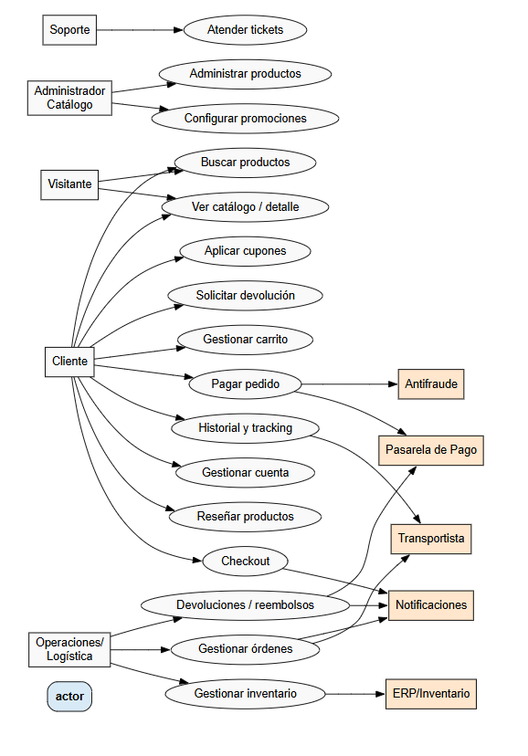

# Tarea 2 — Requerimientos y Casos de Uso para un Sitio de Ventas Online (tipo Amazon/eBay/Walmart)

Bruce Carbonell Castillo Cifuentes
202203069

---

## 1) Alcance y contexto

Plataforma web de comercio electrónico B2C que permite a usuarios navegar el catálogo, gestionar un carrito de compras, pagar con pasarela de pago externa, y realizar seguimiento de pedidos con integración a logística.

---

## 2) Actores

- **Visitante**: usuario no autenticado que navega y busca productos.
- **Cliente**: usuario autenticado que compra, gestiona pedidos, direcciones y métodos de pago.
- **Administrador de Catálogo**: gestiona productos, categorías, precios y promociones.
- **Operaciones/Logística**: gestiona inventario, órdenes, estados de envío y devoluciones.
- **Soporte/Atención al Cliente**: gestiona tickets, reembolsos y comunicación con clientes.
- **Pasarela de Pago (externo)**: sistema tercero para autorizar y capturar pagos (ej. PayPal/Stripe).
- **Transportista (externo)**: servicio de paquetería para envíos y tracking (ej. DHL/UPS).
- **Sistema Antifraude (externo)**: evalúa riesgo de transacciones.
- **Sistema de Notificaciones (externo)**: email/SMS/push transaccional.
- **ERP/Inventario (externo, opcional)**: sincroniza stock y cumplimiento.

---

## 3) Requerimientos funcionales

1. **RF-01 Búsqueda y filtrado**: El sistema permitirá buscar productos por palabras clave y filtrar por categoría, precio, marca, rating, disponibilidad, etc.
2. **RF-02 Catálogo y detalle**: Mostrar lista de productos y página de detalle con imágenes, descripción, precio, variantes (talla/color) y disponibilidad en tiempo real.
3. **RF-03 Carrito de compras**: Permitir agregar, editar cantidad y eliminar ítems; calcular subtotal, impuestos, envío y total.
4. **RF-04 Checkout**: Flujo de compra en pasos (datos, dirección, envío, pago, confirmación) con validaciones y guardado de progreso.
5. **RF-05 Pagos**: Integración con pasarela para autorizar/capturar pagos con tarjetas y/o billeteras; manejo de estados (aprobado, rechazado, pendiente).
6. **RF-06 Gestión de cuentas**: Registro, login (email/contraseña y OAuth opcional), recuperación de contraseña, ver/editar perfil, direcciones y métodos de pago.
7. **RF-07 Órdenes**: Generar orden al confirmar pago; mostrar historial, detalle (ítems, montos), estado (nuevo, preparando, enviado, entregado), y **tracking** de envío.
8. **RF-08 Reseñas y calificaciones**: Clientes podrán calificar y comentar productos (moderación y reporte de abuso).
9. **RF-09 Promociones y cupones**: Aplicar cupones/ descuentos por ítem o carrito con reglas de vigencia y exclusiones.
10. **RF-10 Devoluciones y reembolsos**: Solicitar devoluciones, generar etiqueta de retorno y gestionar reembolsos (parcial/completo) según política.

---

## 4) Requerimientos no funcionales

1. **Rendimiento**: Tiempo de respuesta P95 < 1.5 s para vistas principales (home, categoría, detalle, carrito) con 10k usuarios concurrentes.
2. **Disponibilidad**: 99.9% mensual para servicios críticos (búsqueda, checkout, pagos).
3. **Seguridad**: Autenticación con hashing robusto (p. ej., Argon2/BCrypt), TLS 1.2+ en tránsito, cifrado de datos sensibles en reposo.
4. **Cumplimiento**: Cumplir PCI-DSS (para pagos) y normativa de datos personales aplicable (p. ej., GDPR/ley local).
5. **Escalabilidad**: Arquitectura capaz de **escalar horizontalmente** (auto-scaling) en picos de tráfico (temporadas/promociones).
6. **Observabilidad**: Métricas, logging estructurado y trazas distribuidas; alertas para errores, latencias y caídas de integraciones.
7. **Usabilidad/Accesibilidad**: Diseño responsive (mobile-first), **AA**; flujos claros y mensajes de error accionables.
8. **Mantenibilidad**: Código modular, pruebas automatizadas (unidad/integración/e2e), cobertura mínima 70%
9. **Confiabilidad de datos**: Operaciones de carrito/orden/pago **atómicas** con consistencia eventual en proyecciones (catálogo/cache).
10. **Compatibilidad**: Navegadores modernos (últimas 2 versiones) y app-ready vía API REST/GraphQL estable (versionado).

Diagrama casos de uso
